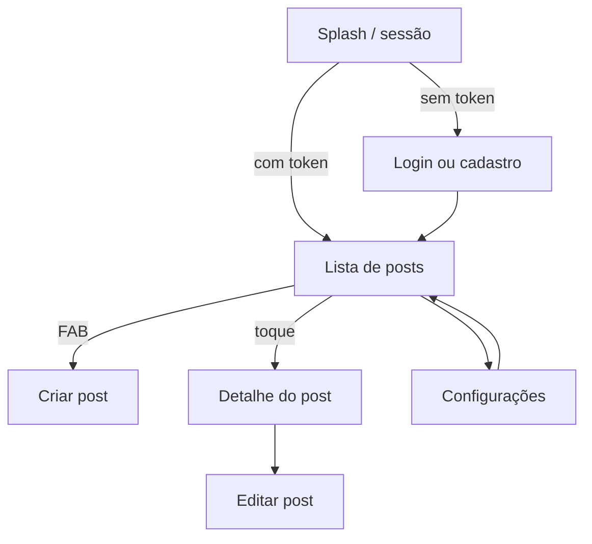

# Dev Feed

Feed de posts full-stack para o usuário final: cadastro, login, feed público e CRUD autenticado com geolocalização nos posts. O front-end é um app **Flutter**; a API é **.NET 10 Minimal API** com **SQLite**, autenticação **JWT + refresh token** e documentação via **Scalar**.

## Sobre o projeto

| Camada | Tecnologia | Descrição |
|--------|------------|-----------|
| App | Flutter 3.13+ | Login, feed, criar/editar/excluir posts, configurações |
| API | .NET 10 Minimal API | REST com JWT, posts públicos e protegidos |
| Banco | SQLite + EF Core | Migrations automáticas na subida; arquivo `dev_feed.db` |

## Estrutura do monorepo

```
dev-feed/
├── DevFeedBackend/     → [README do backend](DevFeedBackend/README.md)
└── dev_feed_app/       → [README do app](dev_feed_app/README.md)
```

Documentação complementar:

| Documento | Conteúdo |
|-----------|----------|
| [`dev_feed_app/README.md`](dev_feed_app/README.md) | Arquitetura Flutter, testes, coverage, screenshots |
| [`DevFeedBackend/README.md`](DevFeedBackend/README.md) | Pacotes, migrations, execução e URLs da API |

## Pré-requisitos

- [.NET 10 SDK](https://dotnet.microsoft.com/download)
- [Flutter 3.13+](https://flutter.dev/docs/get-started/install)

## Quick start

### 1. Backend

```bash
cd DevFeedBackend
dotnet run
```

A API sobe em `http://localhost:5209`. O banco é criado/atualizado automaticamente via EF Core migrations (`Database.Migrate()` na inicialização).

Para migrations, pacotes e documentação interativa (Scalar), consulte [`DevFeedBackend/README.md`](DevFeedBackend/README.md).

### 2. App Flutter

```bash
cd dev_feed_app
flutter pub get
flutter run
```

> O backend deve estar em execução antes de autenticar ou criar posts.

Para arquitetura, testes e coverage, consulte [`dev_feed_app/README.md`](dev_feed_app/README.md).

## Integração app ↔ API

Base URL configurada em `dev_feed_app/lib/src/common/constants/api_constant.dart`:

| Plataforma | URL |
|------------|-----|
| Web / Desktop / iOS | `http://localhost:5209` |
| Android Emulator | `http://10.0.2.2:5209` |

O app consome a API REST do backend. Endpoints, autenticação e schema do banco estão documentados no [README do backend](DevFeedBackend/README.md) e na interface Scalar (`http://localhost:5209/scalar`).

OpenAPI: `http://localhost:5209/openapi/v1.json`

## Funcionalidades

### Autenticação
- Cadastro, login e verificação de sessão (JWT + refresh token)
- ViewModels separados: login, registro e sessão

### Posts
- Feed público (`GET /posts`)
- Criar, editar e excluir posts (autenticado)
- Detalhe com autor e coordenadas (latitude/longitude)

### Configurações
- Tema escuro persistido localmente
- Tela About (versão e copyright)
- Acesso pelo ícone de configurações na AppBar do feed

### Web
- Localização não é solicitada no boot (política do navegador)
- Ao criar post, o browser pode pedir permissão de GPS
- Sem permissão, o app envia coordenadas `0,0` (fallback no repositório)

## Fluxo do usuário



1. Abra o app; a sessão é verificada automaticamente
2. Cadastre-se ou faça login, se necessário
3. Navegue pelo feed de posts
4. Crie um novo post (FAB) ou abra o detalhe de um post existente
5. Edite ou exclua posts autenticado, conforme disponível na UI
6. Ajuste tema e consulte About em Configurações

## Examples of commits

```
git add . && git commit -m ":rocket: Initial commit." && git push
git add . && git commit -m ":building_construction: Added initial project architecture." && git push
git add . && git commit -m ":building_construction: Update project architecture." && git push
git add . && git commit -m ":memo: Updated project documentation." && git push
git add . && git commit -m ":memo: Updated code documentation." && git push
git add . && git commit -m ":white_check_mark: Added feature xyz." && git push
git add . && git commit -m ":wrench: Fixed xyz usage." && git push
git add . && git commit -m ":heavy_minus_sign: Removed xyz." && git push
git add . && git commit -m ":memo: Adjusted project imports." && git push
git add . && git commit -m ":arrow_up: Updated dependencies." && git push
git add . && git commit -m ":arrow_down: Removed dependencies." && git push
git add . && git commit -m ":wastebasket: Removed unused code." && git push
git add . && git commit -m ":test_tube: Added test functionality xyz." && git push
git add . && git commit -m ":construction_worker: Building in progress." && git push
git add . && git commit -m ":construction_worker: Added CI build system." && git push
```

## License

[MIT License](https://opensource.org/licenses/MIT)

Copyright (c) 2026 William Franco.
