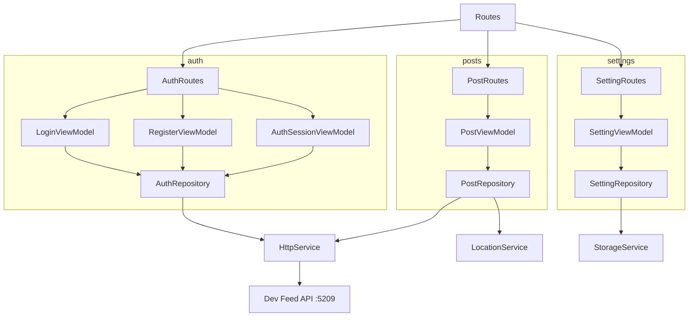

# Dev Feed App

Flutter client for the Dev Feed backend (JWT auth, public feed, authenticated post CRUD, geolocation on create, settings).

Auth, posts, and settings live in separate feature modules with MVVM-style view models (`abstract interface` + `*Impl` extending `StateManagement`).

Auth is split into Login, Register, and Session view models; repositories call the REST API; shared services handle HTTP, storage, connectivity, and location.

No MobX; flat models under `features/*/models/` with `StatePattern` and `ResultPattern` for async flows.

Designed to pair with the .NET Minimal API in the monorepo while remaining a standalone Flutter package.

## Structure



## Stack

| Technology | Version |
|------------|---------|
| Dart SDK | ^3.13.4 |
| connectivity_plus | ^7.1.1 |
| cupertino_icons | ^1.0.8 |
| dio | ^5.9.2 |
| get_it | ^9.2.1 |
| go_router | ^17.2.3 |
| location | ^8.0.1 |
| shared_preferences | ^2.5.5 |
| flutter_lints | ^6.0.0 |
| build_runner | ^2.15.0 |
| mockito | ^5.6.4 |
| Android Gradle Plugin | 9.1.0 |
| Kotlin | 2.4.0 |
| NDK | 30.0.16248370 |
| compileSdk / targetSdk | 36 |
| minSdk | 29 |
| JVM | 25 |
| iOS Deployment Target | 15.0 |
| Swift | 5.0 |

## Architecture

The project is structured in a modular way, where each new functionality should be a new module containing its particularities, and things common to the entire project should be in the `common` module.

```
src/
    ├── common/
    │   ├── constants/
    │   ├── dependency_injectors/
    │   ├── extensions/
    │   ├── patterns/
    │   ├── routes/
    │   ├── services/
    │   ├── state_management/
    │   └── widgets/
    └── features/
        ├── auth/
        │   ├── models/
        │   ├── repositories/
        │   ├── routes/
        │   ├── view_models/
        │   └── views/
        ├── posts/
        │   ├── models/
        │   ├── repositories/
        │   ├── routes/
        │   ├── view_models/
        │   └── views/
        └── settings/
            ├── models/
            ├── repositories/
            ├── routes/
            ├── view_models/
            └── views/
```

## Web / location

On Web, `skipBootLocationCheck` skips `checkLocation()` during `initDependencies()` so the app does not crash before user interaction.

Geolocation is requested when creating a post (`getCurrentLocation()`). Use `http://localhost` or HTTPS for browser geolocation APIs.

If permission is denied or unavailable, coordinates fall back to `0.0` / `0.0` in `PostRepository`. See `lib/src/common/services/location_service.dart`.

## Settings

- Dark theme persisted in `SharedPreferences` (`ValueConstant.darkMode`)
- About screen with version and copyright
- Access from the settings icon on the feed AppBar

## Coverage

flutter pub run build_runner build --delete-conflicting-outputs

flutter test --coverage

genhtml coverage/lcov.info -o coverage/html

open coverage/html/index.html

## ScreenShots

Placeholder paths — add PNG files under `assets/screenshots/` when available.

| Image 1 | Image 2 | Image 3 |
|----------|----------|----------|
|  |  |  |

| Image 4 | Image 5 | Image 6 |
|----------|----------|----------|
|  |  |  |

## Commits

```
git add . && git commit -m ":rocket: Initial commit." && git push
git add . && git commit -m ":building_construction: Added initial project architecture." && git push
git add . && git commit -m ":building_construction: Update project architecture." && git push
git add . && git commit -m ":memo: Updated project documentation." && git push
git add . && git commit -m ":memo: Updated code documentation." && git push
git add . && git commit -m ":white_check_mark: Added feature xyz." && git push
git add . && git commit -m ":wrench: Fixed xyz usage." && git push
git add . && git commit -m ":heavy_minus_sign: Removed xyz." && git push
git add . && git commit -m ":memo: Adjusted project imports." && git push
git add . && git commit -m ":arrow_up: Updated dependencies." && git push
git add . && git commit -m ":arrow_down: Removed dependencies." && git push
git add . && git commit -m ":wastebasket: Removed unused code." && git push
git add . && git commit -m ":test_tube: Added test functionality xyz." && git push
git add . && git commit -m ":construction_worker: Building in progress." && git push
git add . && git commit -m ":construction_worker: Added CI build system." && git push
```

## License

[MIT License](https://opensource.org/licenses/MIT)

Copyright (c) 2026 William Franco.
